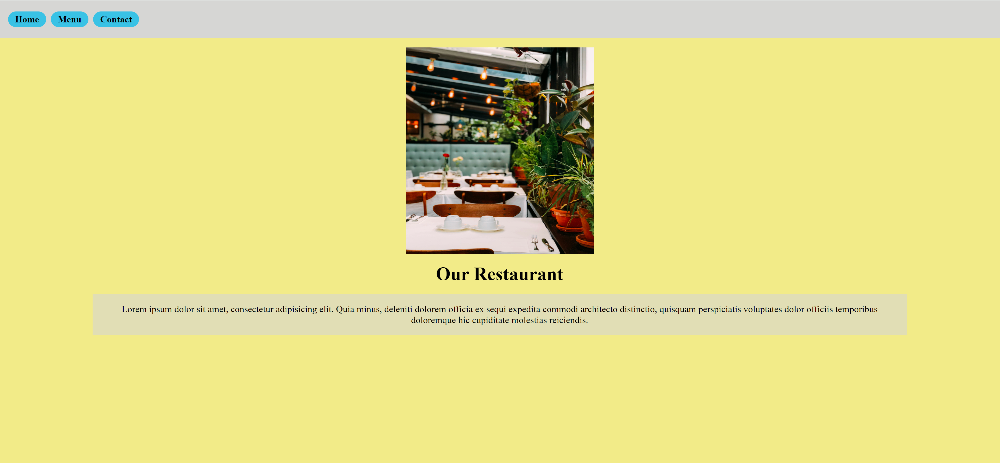
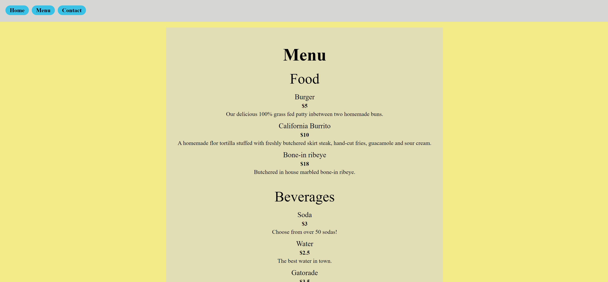
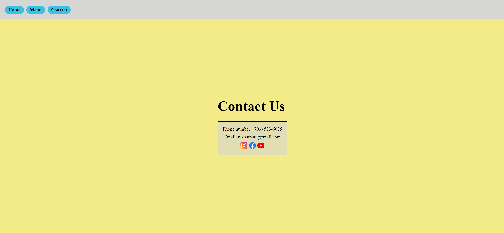

# Restaurant-Page

Restaurant page is a single page application that makes use of NPM and Webpack to create an application that is broken into multiple modules.

### <a href="">LIVE VERSION</a>

### Initial Page

### Menu Page

### Contact Page

## Usage

### index.js

'index.js' is the entry point for webpack. It imports all the individual modules. The main logic that it controls is the navigation from page to page or the calling of one module to another. It does this by adding the navigation logic to the nav buttons. Each button will first clear the main content then load the selected module, which will append their content to the 'content' div in index.html.

### index.html

Our 'src/index.html' file will contain the template that will later be bundled into 'dist/index.html'. The template contains the navigation and an empty 'content' container.

### Initial Page

The initial page introduces you to the restaurant with an image of the restaurant, their name and their company statement. All the logic for initial page is found in the module 'initial-page-load.js', which appends all the initial page content to the 'content' container.

### Menu Page

Menu page will contain all menu items for the restaurant. The 'menu-page-load.js' module makes use of classes to allow for the creation of menu item objects.

### Contact Page

Contact page shows all forms of contact for the restaurant. The 'contact-page-load.js' module makes use of webpack asset management and to include 'png' images.

## Learning Objectives

The main objectives for this project were to modularize my code with the use of NPM and Webpack. Utilizing the two to separate the main pages of my progam into individual modules that would be bundled. While also making use of Webpack's asset management to bundle assets within each page.

## Authors and Acknowledgment

Jerry Hara (Github: @timeismonkey)

### Restaurant image:

Photo by <a href="https://unsplash.com/@chrisliverani?utm_content=creditCopyText&utm_medium=referral&utm_source=unsplash">Chris Liverani</a> on <a href="https://unsplash.com/photos/formal-dinner-setup-oCsaxvGCehM?utm_content=creditCopyText&utm_medium=referral&utm_source=unsplash">Unsplash</a>
